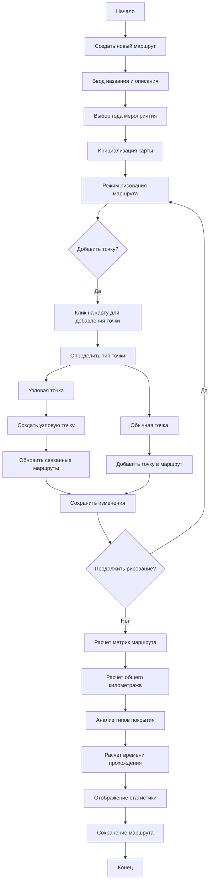
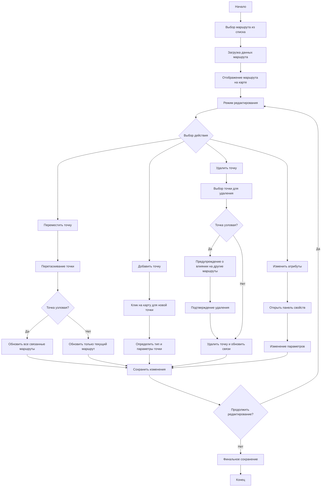
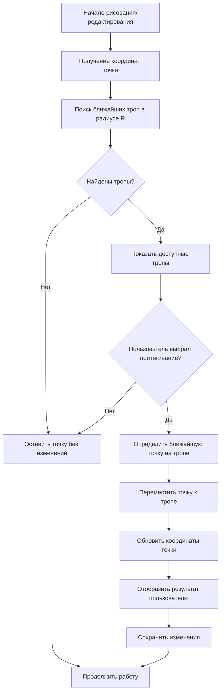
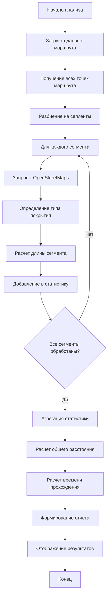
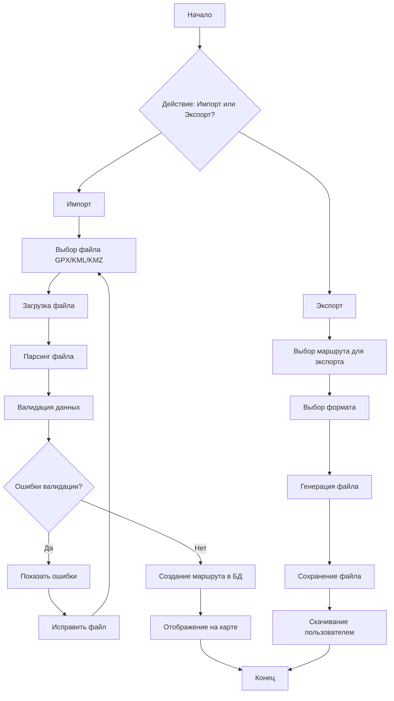
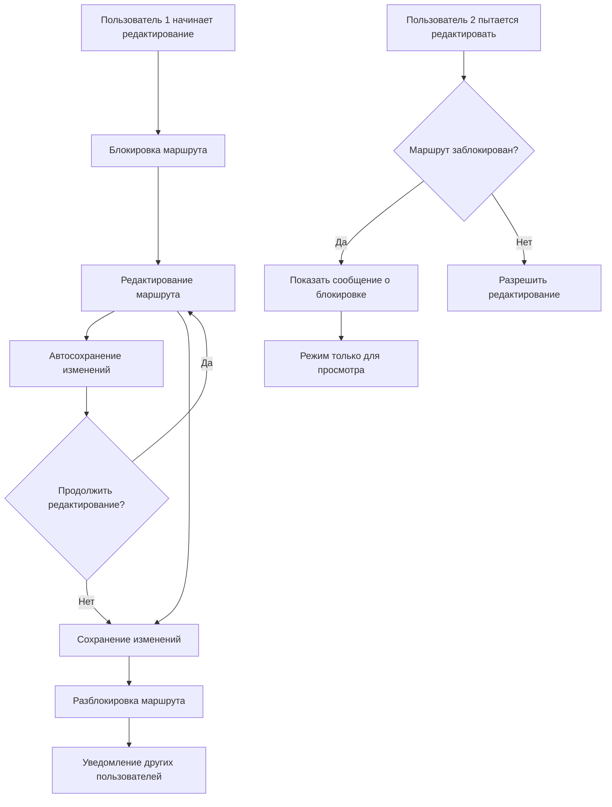
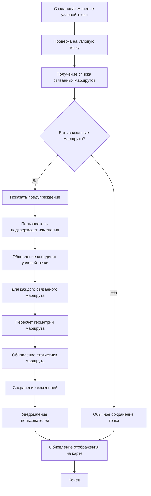
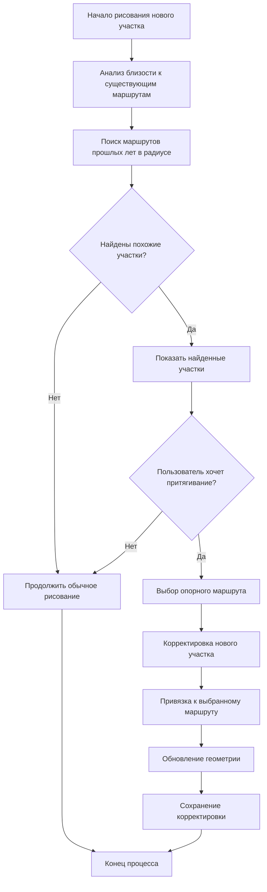
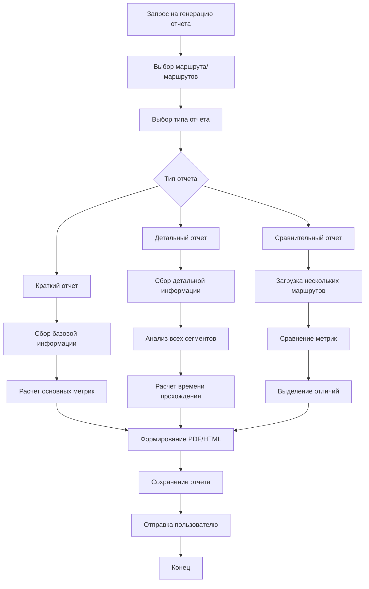

# Блок-схемы процессов
## Приложение для разработки маршрутов "Майской прогулки"

### 1. Процесс создания нового маршрута

### 2. Процесс редактирования существующего маршрута

### 3. Процесс автоматического притягивания к тропам

### 4. Процесс анализа маршрута

### 5. Процесс импорта/экспорта данных

### 6. Процесс совместной работы

### 7. Процесс работы с узловыми точками

### 8. Процесс притягивания к маршрутам прошлых лет

### 9. Процесс генерации отчетов

